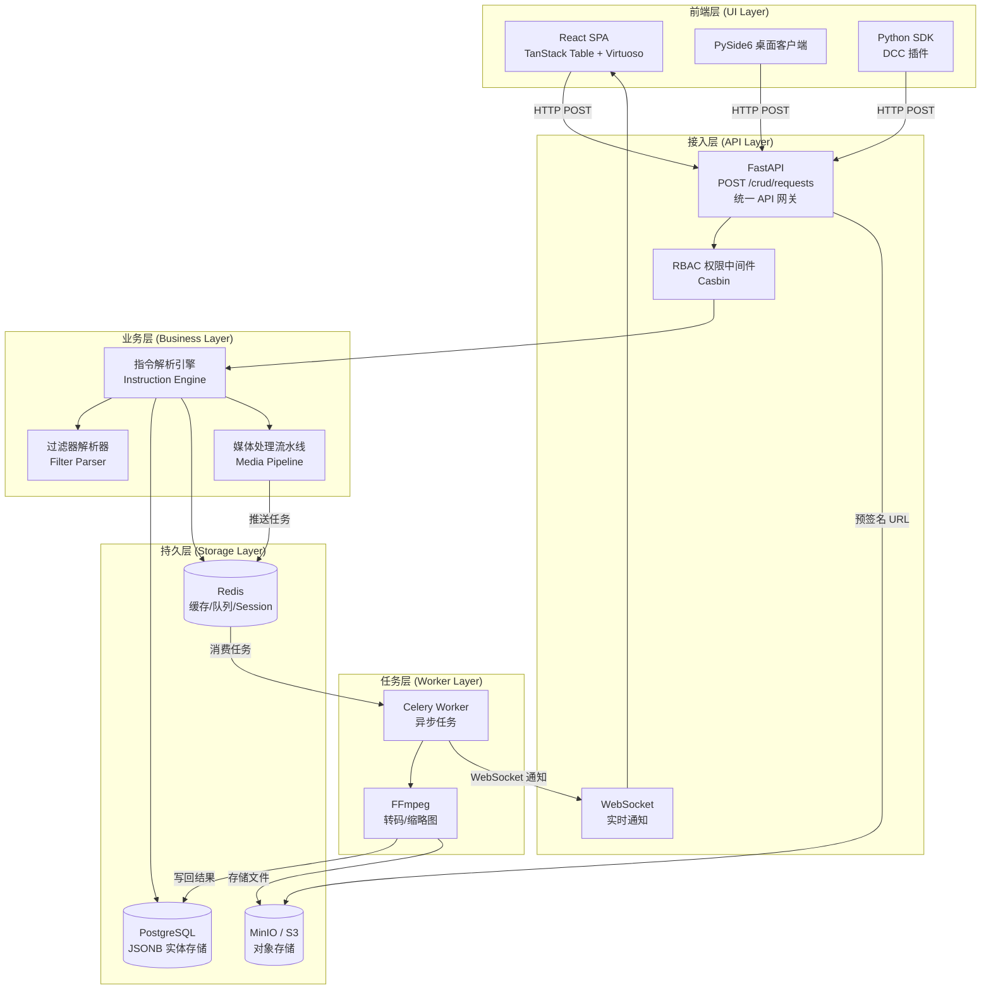
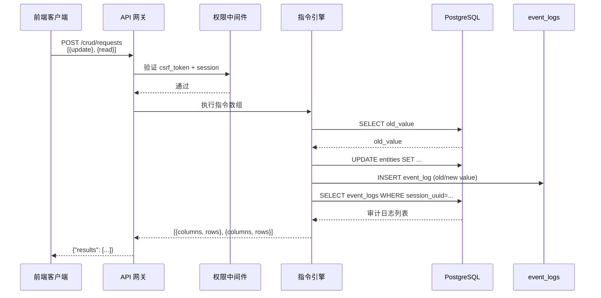
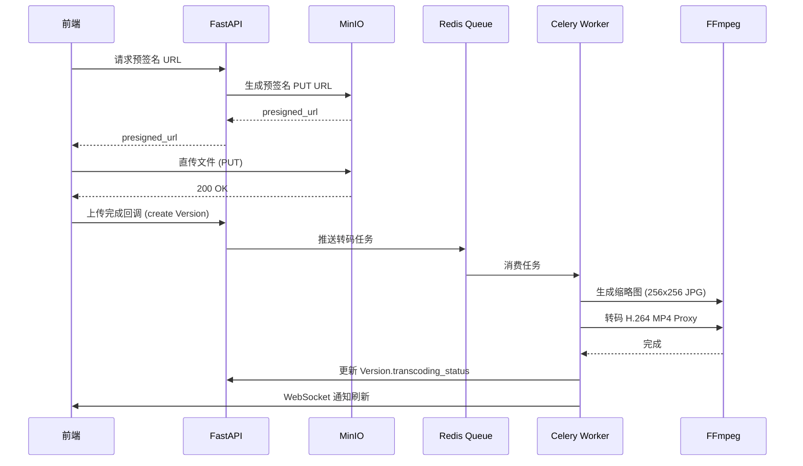
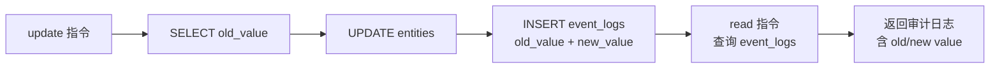

# Design Document: ShotStudio

## Overview

ShotStudio 是一个工业级影视全流程项目管理系统，复刻 Autodesk Shotgun Studio 的核心功能。系统采用 **"单一 API 网关 + 批量指令集 + JSONB 桶存储"** 架构，覆盖从项目立项、资产创建、镜头排期、任务分发到媒体审阅的完整生产生命周期。

核心设计目标：
- 单一端点 `POST /crud/requests` 作为全系统数据总线，支持批量指令执行
- PostgreSQL JSONB 实现无限动态字段扩展，无需频繁变更 Schema
- 前端虚拟化网格支持 2000 行 × 100 列流畅渲染
- Write-Read 联动：update 指令自动生成审计日志，后续 read 指令可立即查询
- 行列分离返回格式（`columns` + `rows`）压缩高频请求体积

---

## Architecture

### 系统整体架构



### 请求处理流程



---

## Components and Interfaces

### 1. API 网关 (API Gateway)

**职责**：接收请求、验证 CSRF、提取 session_uuid、按序分发指令、聚合结果。

```python
# 核心接口签名
POST /crud/requests
Content-Type: application/x-www-form-urlencoded

Form params:
  requests: str          # JSON 数组字符串
  csrf_token: str        # 必须
  session_uuid: UUID     # 可选，用于审计追踪
  batch_transaction: bool = False
  bkgd: bool = False

Response:
{
  "results": [
    {
      "columns": ["id", "code", "sg_status", ...],
      "rows": [[153, "SMD", "Active", ...], ...],
      "paging_info": {"total_count": 100, "total_pages": 2}
    }
  ]
}
```

**设计决策**：使用 `application/x-www-form-urlencoded` 而非 JSON body，与 Shotgun 原始协议保持兼容，便于未来对接第三方工具。

### 2. 指令解析引擎 (Instruction Engine)

**职责**：解析 `request_type`，路由到对应处理器，管理事务边界。

```python
class InstructionEngine:
    async def execute_batch(
        self,
        requests: list[dict],
        session_uuid: UUID,
        batch_transaction: bool,
        user: User
    ) -> list[dict]: ...

    async def handle_read(self, req: ReadRequest, user: User) -> dict: ...
    async def handle_create(self, req: CreateRequest, session_uuid: UUID, user: User) -> dict: ...
    async def handle_update(self, req: UpdateRequest, session_uuid: UUID, user: User) -> dict: ...
    async def handle_delete(self, req: DeleteRequest, session_uuid: UUID, user: User) -> dict: ...
    async def handle_summarize(self, req: SummarizeRequest, user: User) -> dict: ...
    async def handle_group_summarize(self, req: GroupSummarizeRequest, user: User) -> dict: ...
```

### 3. 过滤器解析器 (Filter Parser)

**职责**：将 API 过滤条件对象递归转换为 SQLAlchemy 查询条件。

```python
class FilterParser:
    def parse(self, filters: dict) -> ClauseElement: ...
    def _parse_condition(self, condition: dict) -> ClauseElement: ...
    def _apply_relation(self, path: str, relation: str, values: list) -> ClauseElement: ...
    def format(self, clause: ClauseElement) -> dict: ...  # Pretty Printer
```

支持的 relation 映射：

| API relation | SQL 等价 |
|---|---|
| `is` | `= value` |
| `is_not` | `!= value` |
| `in` | `IN (values)` |
| `contains` | `LIKE '%value%'` |
| `not_contains` | `NOT LIKE '%value%'` |
| `greater_than` | `> value` |
| `less_than` | `< value` |
| `ends_with` | `LIKE '%value'` |
| `type_is` | `links->>'type' = value` |

### 4. 媒体处理流水线 (Media Pipeline)



### 5. 前端超级网格 (Grid Engine)

**职责**：虚拟化渲染 2000 行 × 100 列数据，管理列状态、过滤、分组。

```
TanStack Table (v8)
  ├── 列状态管理（排序、隐藏、固定、拖拽）
  ├── 行选中与批量编辑
  ├── 列分组（Pipeline Step 聚合列）
  └── 过滤状态

React-Virtuoso
  ├── 行虚拟化（仅渲染视口内行）
  ├── 列虚拟化（仅渲染视口内列）
  └── 固定列支持（ID, Thumbnail）

Zustand
  ├── 当前项目状态
  ├── 选中行 ID 集合
  └── 全局 UI 状态

Immer
  └── 不可变嵌套状态更新
```

### 6. RBAC 权限中间件

```python
# 角色层级
Admin > Producer > Art_Director > Artist > Client

# Casbin 策略示例
p, Admin,       *, *
p, Producer,    project:*, read|write
p, Art_Director,task:*,   read|write
p, Artist,      task:own,  read|write
p, Client,      project:assigned, read
```

---

## Data Models

### 核心表结构

#### `entities` 表（全实体统一存储）

```sql
CREATE TABLE entities (
    id          SERIAL PRIMARY KEY,
    type        VARCHAR(50) NOT NULL,           -- 'Project'|'Asset'|'Shot'|'Task'|'Version'|'Note'|...
    code        TEXT,                           -- 核心标识名称，如 'S01_C001'
    project_id  INTEGER REFERENCES entities(id),-- 顶层项目 ID（隔离索引）
    
    -- 动态属性桶：存储所有业务字段
    -- 示例: {"sg_status": "Active", "sg_fps": 24, "sg_cut_in": 1001}
    attributes  JSONB NOT NULL DEFAULT '{}',
    
    -- 关联桶：存储多态引用和集合
    -- 示例: {"step": {"id": 13, "type": "Step", "name": "Animation"},
    --         "task_assignees": [{"id": 5, "type": "HumanUser", "name": "Alice"}]}
    links       JSONB NOT NULL DEFAULT '{}',
    
    is_retired  BOOLEAN NOT NULL DEFAULT FALSE, -- 软删除标记
    is_template BOOLEAN NOT NULL DEFAULT FALSE, -- 模板标记
    uuid        UUID NOT NULL DEFAULT gen_random_uuid(),
    created_at  TIMESTAMPTZ NOT NULL DEFAULT NOW(),
    updated_at  TIMESTAMPTZ NOT NULL DEFAULT NOW(),
    created_by  INTEGER REFERENCES entities(id),
    updated_by  INTEGER REFERENCES entities(id)
);

-- 索引
CREATE INDEX idx_entities_main     ON entities (type, project_id, is_retired);
CREATE INDEX idx_entities_attrs    ON entities USING GIN (attributes);
CREATE INDEX idx_entities_links    ON entities USING GIN (links);
CREATE INDEX idx_entities_code     ON entities (code);
CREATE INDEX idx_entities_uuid     ON entities (uuid);
```

**JSONB 字段键名约定**：

| 实体类型 | `attributes` 常用键 | `links` 常用键 |
|---|---|---|
| Project | `sg_status`, `sg_fps`, `sg_resx`, `sg_resy`, `billboard` | `members` |
| Asset | `sg_asset_type`, `sg_status_list` | `tags`, `tasks` |
| Shot | `sg_cut_in`, `sg_cut_out`, `sg_sequence_code` | `sequence`, `tasks` |
| Task | `sg_status_list`, `start_date`, `due_date`, `duration` | `assignees`, `step` |
| Version | `sg_uploaded_movie_transcoding_status`, `version_number` | `task`, `user` |
| Note | `subject`, `content`, `read_by_current_user` | `note_links` |

#### `event_logs` 表（审计日志）

```sql
CREATE TABLE event_logs (
    id           BIGSERIAL PRIMARY KEY,
    session_uuid UUID NOT NULL,
    event_type   VARCHAR(100),                  -- 'attribute_change'|'create'|'delete'
    entity_type  VARCHAR(50) NOT NULL,
    entity_id    INTEGER NOT NULL,
    meta         JSONB NOT NULL DEFAULT '{}',   -- {attribute_name, old_value, new_value, field_data_type}
    created_at   TIMESTAMPTZ NOT NULL DEFAULT NOW()
);

CREATE INDEX idx_event_logs_lookup  ON event_logs (session_uuid, id ASC);
CREATE INDEX idx_event_logs_entity  ON event_logs (entity_type, entity_id);
CREATE INDEX idx_event_logs_time    ON event_logs (created_at);
```

#### `entity_relationships` 表（任务依赖/多对多关系）

```sql
CREATE TABLE entity_relationships (
    id            SERIAL PRIMARY KEY,
    from_id       INTEGER NOT NULL REFERENCES entities(id),
    to_id         INTEGER NOT NULL REFERENCES entities(id),
    relation_type VARCHAR(50) NOT NULL,         -- 'dependency'|'parent_child'|'link'
    metadata      JSONB NOT NULL DEFAULT '{}',  -- {dependency_type: 'FS'|'SS', offset_days: 0}
    created_at    TIMESTAMPTZ NOT NULL DEFAULT NOW()
);

CREATE INDEX idx_rel_from ON entity_relationships (from_id);
CREATE INDEX idx_rel_to   ON entity_relationships (to_id);
CREATE UNIQUE INDEX idx_rel_unique ON entity_relationships (from_id, to_id, relation_type);
```

#### `field_definitions` 表（动态字段定义）

```sql
CREATE TABLE field_definitions (
    id           SERIAL PRIMARY KEY,
    project_id   INTEGER REFERENCES entities(id),  -- NULL 表示全局字段
    entity_type  VARCHAR(50) NOT NULL,
    name         VARCHAR(100) NOT NULL,             -- 内部 key，如 'material_type'
    display_name VARCHAR(255) NOT NULL,             -- UI 显示名，如 '材质类型'
    data_type    VARCHAR(50) NOT NULL,              -- 'text'|'number'|'list'|'checkbox'|'entity_link'
    config       JSONB NOT NULL DEFAULT '{}',       -- 下拉选项、校验规则、可见角色列表
    created_at   TIMESTAMPTZ NOT NULL DEFAULT NOW()
);

CREATE UNIQUE INDEX idx_field_def_unique ON field_definitions (project_id, entity_type, name);
```

#### `page_configs` 表（用户视图配置）

```sql
CREATE TABLE page_configs (
    id          SERIAL PRIMARY KEY,
    user_id     INTEGER REFERENCES entities(id),
    project_id  INTEGER REFERENCES entities(id),
    page_key    VARCHAR(100) NOT NULL,             -- 如 'assets_grid', 'shots_grid'
    config      JSONB NOT NULL DEFAULT '{}',       -- {filters, column_widths, column_order, grouping}
    is_public   BOOLEAN NOT NULL DEFAULT FALSE,
    created_at  TIMESTAMPTZ NOT NULL DEFAULT NOW(),
    updated_at  TIMESTAMPTZ NOT NULL DEFAULT NOW()
);

CREATE INDEX idx_page_configs_lookup ON page_configs (user_id, project_id, page_key);
```

### 数据流：Write-Read 联动



### 返回格式：行列分离

```json
{
  "results": [
    {
      "columns": ["id", "code", "sg_status", "updated_by"],
      "rows": [
        [153, "SMD", "Active", {"id": 88, "type": "HumanUser", "name": "LI YUQING"}],
        [154, "TKY", "Archive", {"id": 12, "type": "HumanUser", "name": "WANG FANG"}]
      ],
      "paging_info": {
        "current_page": 1,
        "records_per_page": 50,
        "total_count": 2,
        "total_pages": 1
      }
    }
  ]
}
```

**设计决策**：行列分离格式相比对象数组可减少 30-60% 的响应体积（省去重复的 key 名），对 2000 行 × 100 列场景尤为关键。

---

## Correctness Properties

*A property is a characteristic or behavior that should hold true across all valid executions of a system — essentially, a formal statement about what the system should do. Properties serve as the bridge between human-readable specifications and machine-verifiable correctness guarantees.*

### Property 1: 批量指令结果顺序一致性

*For any* 包含 N 个有效指令的 requests 数组，返回的 results 数组长度应等于 N，且 results[i] 对应 requests[i] 的执行结果。

**Validates: Requirements 1.2**

---

### Property 2: 批量事务原子性

*For any* 包含至少一个无效指令的 requests 数组（`batch_transaction=true`），执行后数据库状态应与执行前完全相同，所有有效指令的副作用均不应持久化。

**Validates: Requirements 1.3**

---

### Property 3: 行列分离格式与列投影一致性

*For any* 包含 `columns` 列表的 read 请求，响应中的 `columns` 数组应与请求的列表完全匹配，且每个 `rows` 中的子数组长度应等于 `columns` 数组长度。

**Validates: Requirements 1.4, 2.5**

---

### Property 4: session_uuid 审计传播

*For any* 携带 `session_uuid` 的 create 或 update 请求，执行后 `event_logs` 表中应存在至少一条 `session_uuid` 字段与请求中完全相同的记录。

**Validates: Requirements 1.6, 3.3, 4.2**

---

### Property 5: 过滤器正确性

*For any* 使用支持的关系运算符（`is`、`is_not`、`in`、`contains`、`not_contains`、`greater_than`、`less_than`、`ends_with`、`type_is`）构造的过滤条件，返回的所有实体均应满足该过滤条件，且所有满足条件的实体均应被返回（无遗漏）。

**Validates: Requirements 2.2**

---

### Property 6: 嵌套过滤器与取反

*For any* 过滤条件 F，使用 `negate: true` 包装后的查询结果应与不使用 `negate` 的查询结果互补（两者并集为全集，交集为空集）。

**Validates: Requirements 2.3, 2.4**

---

### Property 7: 分页完整性

*For any* 数据集和分页参数（`current_page`、`records_per_page`），遍历所有页面获取的实体集合应等于不分页时获取的完整实体集合，且每页实体数量不超过 `records_per_page`。

**Validates: Requirements 2.6**

---

### Property 8: 排序正确性

*For any* 包含 `sorts` 参数的 read 请求，返回结果中相邻两行在排序字段上应满足指定的排序方向（asc 时前行值 ≤ 后行值，desc 时前行值 ≥ 后行值）。

**Validates: Requirements 2.7**

---

### Property 9: 分组一致性

*For any* 包含 `grouping` 参数的 read 请求，同一分组内的所有实体在分组字段上应具有相同的值。

**Validates: Requirements 2.8**

---

### Property 10: 关联字段富引用

*For any* 包含关联字段（links 中的引用）的实体，当该字段被请求时，返回值应为包含 `id`、`type`、`name` 三个字段的对象，而非仅返回 ID。

**Validates: Requirements 2.9**

---

### Property 11: 实体创建 Round-Trip

*For any* 包含任意标量字段和关联字段的 create 指令，创建成功后立即执行 read 指令查询该实体，返回的字段值应与创建时提交的 `field_values` 语义等价（标量字段在 `attributes` 中，关联字段在 `links` 中）。

**Validates: Requirements 3.1, 3.2**

---

### Property 12: 更新审计日志完整性

*For any* update 指令，执行后 `event_logs` 中应存在一条记录，包含正确的 `attribute_name`、`old_value`（等于更新前的字段值）、`new_value`（等于更新后的字段值）和 `field_data_type`。

**Validates: Requirements 4.1, 4.2**

---

### Property 13: Write-Read 联动可见性

*For any* 包含 `[update, read_event_logs]` 的批量请求，read 指令应能查询到 update 指令在同一请求中产生的审计日志条目。

**Validates: Requirements 4.4**

---

### Property 14: JSONB 数组追加模式

*For any* 使用 `multi_entity_update_mode=add` 的 update 指令，执行后目标 JSONB 数组应包含原有的所有元素加上新追加的元素，原有元素不应丢失。

**Validates: Requirements 4.3**

---

### Property 15: 软删除不可见性

*For any* 已被软删除（`is_retired=true`）的实体，在不携带 `include_retired=true` 的 read 请求中，该实体不应出现在返回结果中。

**Validates: Requirements 5.1, 5.2**

---

### Property 16: 聚合计算正确性

*For any* summarize 指令，`record_count` 的结果应等于满足过滤条件的实体数量；`status_percentage` 的结果应等于具有指定状态值的实体数量除以总实体数量。

**Validates: Requirements 5.3**

---

### Property 17: 过滤器 Round-Trip（解析-格式化-解析）

*For any* 有效的过滤条件对象，经过 `parse → format → parse` 的 round-trip 后，两次解析产生的 SQL WHERE 子句应语义等价（产生相同的查询结果集）。

**Validates: Requirements 17.3**

---

### Property 18: 页面配置 Round-Trip

*For any* 有效的页面配置对象，存储到 `page_configs` 后再读取，得到的配置对象应与存储前的配置对象语义等价。

**Validates: Requirements 13.3, 17.5**

---

### Property 19: 级联软删除完整性

*For any* 被软删除的 Asset 或 Shot，其所有关联 Task 应同时被软删除；对于被软删除的 Task，其所有关联 Version 应同时被软删除。

**Validates: Requirements 15.1, 15.2**

---

### Property 20: 级联删除审计覆盖

*For any* 触发级联软删除的操作，每个被影响的实体（包括间接级联的实体）在 `event_logs` 中应各自存在独立的审计条目。

**Validates: Requirements 15.4**

---

### Property 21: RBAC 字段过滤

*For any* 在 `field_definitions` 中配置了可见角色列表的字段，当无权限角色的用户执行 read 请求时，该字段不应出现在返回的 `columns` 和 `rows` 中。

**Validates: Requirements 14.4, 14.5**

---

### Property 22: 通知接收者完整性

*For any* 关联到某个 Task 的 Note 创建操作，该 Task 的所有 `task_assignees` 均应收到通知记录，且通知数量等于 assignees 数量。

**Validates: Requirements 16.2**

---

### Property 23: 版本号自增

*For any* 针对同一 Task 提交的多个 Version，版本号应严格递增（后提交的版本号大于先提交的版本号）。

**Validates: Requirements 11.1**

---

## Error Handling

### 错误响应格式

所有错误统一返回以下格式：

```json
{
  "error": {
    "code": "VALIDATION_ERROR",
    "message": "字段 'type' 为必填项",
    "details": {
      "field": "type",
      "request_index": 0
    }
  }
}
```

### 错误分类

| 错误类型 | HTTP 状态码 | 触发条件 |
|---|---|---|
| `CSRF_INVALID` | 403 | csrf_token 无效或缺失 |
| `VALIDATION_ERROR` | 400 | 必填字段缺失、字段类型不匹配 |
| `ENTITY_NOT_FOUND` | 404 | update/delete 目标实体不存在 |
| `PERMISSION_DENIED` | 403 | RBAC 权限不足 |
| `TRANSACTION_FAILED` | 409 | batch_transaction=true 时部分指令失败，已回滚 |
| `FILTER_PARSE_ERROR` | 400 | 过滤条件格式无效，含具体错误位置 |
| `TRANSCODING_FAILED` | - | 异步错误，写入 event_logs，WebSocket 通知 |

### 关键错误处理策略

1. **批量事务回滚**：`batch_transaction=true` 时，任意指令失败触发全量回滚，返回 409 并说明失败的指令索引。
2. **非事务批量**：默认模式下，各指令独立执行，失败的指令在对应 results 位置返回错误对象，不影响其他指令。
3. **级联删除失败**：若级联软删除中途失败，整个操作回滚，返回包含失败原因的错误信息。
4. **转码失败**：异步错误不影响 API 响应，通过 WebSocket 推送失败通知，并在 event_logs 中记录错误详情。
5. **过滤器解析错误**：返回包含具体错误位置（字段路径、条件索引）的描述性错误，便于前端定位问题。

---

## Testing Strategy

### 双轨测试方法

ShotStudio 采用单元测试与属性测试互补的双轨策略：

- **单元测试**：验证具体示例、边界条件和错误场景
- **属性测试**：验证对所有输入均成立的普遍性质

两者缺一不可：单元测试捕获具体 bug，属性测试验证通用正确性。

### 属性测试配置

**选用库**：
- 后端（Python）：`hypothesis`
- 前端（TypeScript）：`fast-check`

**配置要求**：
- 每个属性测试最少运行 **100 次迭代**
- 每个属性测试必须通过注释标注对应的设计文档属性编号
- 标注格式：`# Feature: shotstudio, Property {N}: {property_text}`

### 属性测试实现指南

每个 Correctness Property 对应一个属性测试：

```python
# Feature: shotstudio, Property 3: 行列分离格式与列投影一致性
@given(
    columns=st.lists(st.sampled_from(VALID_COLUMNS), min_size=1, max_size=20),
    entity_type=st.sampled_from(["Asset", "Shot", "Task", "Project"])
)
@settings(max_examples=100)
def test_columns_projection_consistency(columns, entity_type):
    response = api_client.post("/crud/requests", data={
        "requests": json.dumps([{
            "request_type": "read",
            "type": entity_type,
            "columns": columns
        }])
    })
    result = response.json()["results"][0]
    assert result["columns"] == columns
    for row in result["rows"]:
        assert len(row) == len(columns)
```

```python
# Feature: shotstudio, Property 17: 过滤器 Round-Trip
@given(filter_obj=filter_strategy())
@settings(max_examples=200)
def test_filter_round_trip(filter_obj):
    sql1 = filter_parser.parse(filter_obj)
    formatted = filter_parser.format(sql1)
    sql2 = filter_parser.parse(formatted)
    # 两次解析产生相同结果集
    results1 = execute_query(sql1)
    results2 = execute_query(sql2)
    assert set(r["id"] for r in results1) == set(r["id"] for r in results2)
```

### 单元测试重点

单元测试聚焦以下场景（避免与属性测试重复）：

1. **具体示例**：
   - CSRF token 验证（有效/无效 token 的具体响应）
   - 创建实体后返回 id 和 uuid
   - 必填字段缺失时的错误消息格式

2. **边界条件**：
   - 空 requests 数组
   - 单条记录的分页（total_pages=1）
   - 版本号从 v001 开始自增

3. **集成测试**：
   - Write-Read 联动完整流程（update → read event_logs）
   - 媒体上传 → 转码 → WebSocket 通知完整链路
   - 级联软删除（Asset → Tasks → Versions）

### 测试覆盖矩阵

| 需求 | 属性测试 | 单元测试 |
|---|---|---|
| 批量指令顺序 | Property 1 | - |
| 事务原子性 | Property 2 | 具体失败场景 |
| 行列分离格式 | Property 3 | - |
| 过滤器正确性 | Property 5, 6 | 各运算符示例 |
| 分页完整性 | Property 7 | 边界页码 |
| 软删除 | Property 15 | - |
| 过滤器 Round-Trip | Property 17 | 无效过滤器错误 |
| 级联删除 | Property 19, 20 | 失败回滚 |
| RBAC 字段过滤 | Property 21 | 各角色权限示例 |
| 版本号自增 | Property 23 | v001 起始值 |
